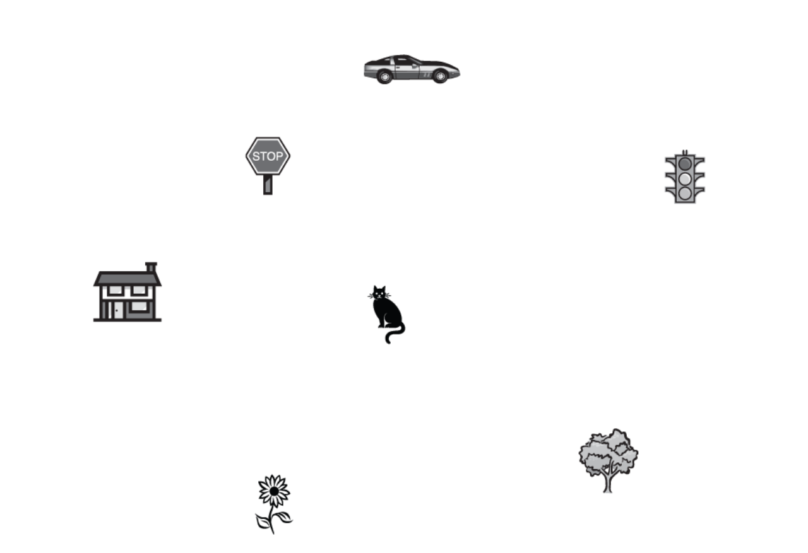

# Perspective Taking/Spatial Orientation Test (PTSOT)

This project is a simple web-based adaptation of the "Perspective Taking/Spatial Orientation Test" by Hegarty, Kozhevnikov, and Waller. 
It consists of a lightweight **Python Flask backend** and a **JavaScript frontend**.
The project is based on [TimDomino's PTSOT GitHub project](https://github.com/TimDomino/ptsot).

Reference documentation: [SILC Object Perspective/Spatial Orientation Test](https://www.silc.northwestern.edu/object-perspective-spatial-orientation-test/)

---

## Project Structure

```bash
.
├── backend
│   ├── main.py
│   ├── requirements.txt
│   └── venv/
├── frontend
│   ├── index.html
│   ├── object_array.png
│   └── script.js
├── README.md
└── visualization
    ├── main.py
    ├── plots/
    ├── task_images.py
    └── venv/
```

---

## How to Run

### Backend
1. Navigate to the `backend/` folder.
2. Set up a virtual environment and install dependencies:
   ```bash
   python3 -m venv venv
   source venv/bin/activate
   pip install -r requirements.txt
   ```
3. Start the Flask server:
   ```bash
   python main.py
   ```

### Frontend
Simply open `frontend/index.html` in your browser. It communicates with the backend to fetch and submit data.

---

## Visualization

The `visualization/` directory contains scripts for generating plots and task images:
- `main.py`: Used to create task images.
- `task_images.py`: Helper functions for image creation.
- `plots/`: Folder containing generated task plots.

You can run the visualization script similarly to the backend setup:
```bash
cd visualization
python main.py
```

---

## Dependencies
- Python 3
- Flask
- Matplotlib

Install Python packages via pip:
```bash
pip install flask matplotlib
```

---

## Based On
This project is inspired by and derived from:

- Hegarty, M., & Waller, D. (2004). A dissociation between mental rotation and perspective-taking spatial abilities. *Intelligence, 32*, 175-191.
- Kozhevnikov, M., & Hegarty, M. (2001). A dissociation between object-manipulation and perspective-taking spatial abilities. *Memory & Cognition, 29*, 745-756.

---

## Screenshot



---

## License

This project follows the same licensing terms as the original [TimDomino/ptsot](https://github.com/TimDomino/ptsot) repository.